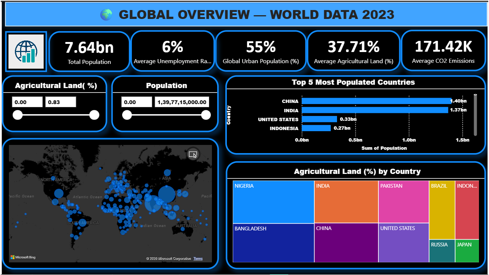

# 🌍 World Data 2023: Global Overview Dashboard (Power BI)

## 📌 Project Overview
This project presents a Power BI dashboard built to analyze global data for 2023. It includes insights on population, CO2 emissions, agriculture, health, and economic indicators across different countries.

## 📊 Key Features
- Global overview of population and economic indicators
- Environment analysis (CO2 emissions, agricultural land)
- Health insights (birth rate, healthcare access)
- Economy and employment trends
- Interactive filters and slicers for better analysis

## 🛠 Tools & Technologies
- Power BI
- DAX
- Power Query
- Data Modeling

## 📂 Data Model
The project uses a structured data model with fact and dimension tables:
- Fact Table: Contains key metrics like CO2 emissions, CPI, birth rate
- Dimension Tables: Country and demographic details

## 📸 Dashboard Preview

### Global Overview

### Environment Dashboard

### Health Dashboard

### Economy Dashboard

## 🚀 Key Insights
- Identified countries with highest CO2 emissions
- Compared population density with emissions
- Analyzed relationship between healthcare and expenditure
- Observed trends in unemployment and tax revenue

## 📎 How to Use
1. Download the `.pbix` file
2. Open in Power BI Desktop
3. Explore dashboards using filters

---
